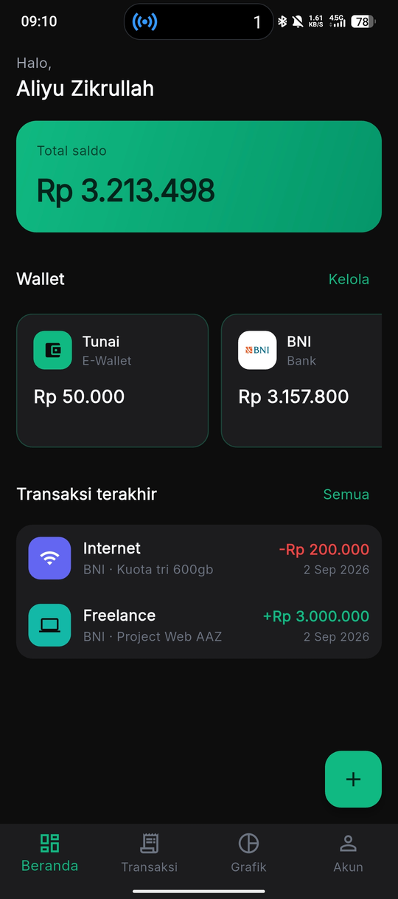
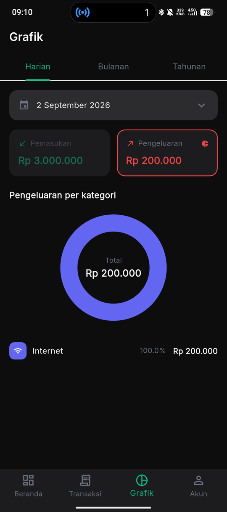
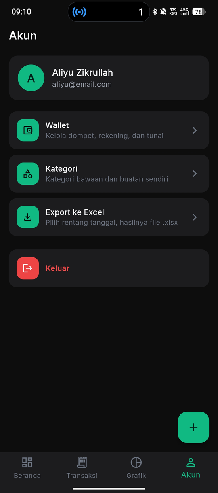

# Grivinance

Aplikasi pencatatan keuangan personal untuk pengguna Indonesia. Mendukung
banyak dompet sekaligus — e-wallet, rekening bank, dan uang tunai — dengan
saldo tiap dompet yang selalu ikut menyesuaikan setiap kali ada transaksi.

Monorepo: REST API di `backend/`, aplikasi Android di `mobile/`.

<p align="center">
  
  
  
</p>

## Fitur

- **Multi-wallet** — e-wallet, bank, dan tunai dengan ikon, warna, dan logo
  bank/e-wallet asli
- **Transaksi** — pemasukan dan pengeluaran, dengan filter tipe, wallet,
  kategori, dan rentang tanggal
- **Kategori** — 16 preset global plus kategori buatan sendiri
- **Grafik** — donut rincian per kategori (harian dan bulanan) serta grafik
  batang 12 bulan
- **Export Excel** — pilih rentang tanggal, hasilnya `.xlsx`
- **Autentikasi JWT** — access token berumur pendek dengan refresh otomatis

## Stack

| Bagian | Teknologi |
|---|---|
| Mobile | Flutter 3.47, Riverpod, Dio, go_router, fl_chart |
| Backend | Node.js 20, Express 5, TypeScript |
| Database | PostgreSQL 18 + Prisma 7 |
| Deploy | Docker, Coolify, Cloudflare Tunnel |

## Struktur

```
backend/
├── prisma/           skema database + seeder kategori preset
├── src/
│   ├── controllers/  parsing request, tidak ada logika bisnis
│   ├── services/     seluruh logika bisnis
│   ├── routes/       definisi endpoint + validasi input
│   ├── middlewares/  autentikasi, penanganan hasil validasi
│   └── utils/        JWT, format respons, rentang tanggal WIB
└── test/             uji end-to-end lewat HTTP

mobile/
└── lib/
    ├── core/         tema, router, konstanta, formatter
    ├── data/         model, repository, klien HTTP, secure storage
    ├── providers/    state Riverpod
    └── presentation/ layar dan widget
```

## Menjalankan secara lokal

### Backend

```bash
cd backend
npm install
cp .env.example .env        # isi DATABASE_URL dan secret-nya
npx prisma migrate dev
npx prisma db seed
npm run dev
```

Butuh PostgreSQL yang bisa diakses. Semua variabel yang wajib diisi ada di
`.env.example`.

### Mobile

```bash
cd mobile
flutter pub get
flutter run
```

Alamat API default menunjuk ke server produksi. Untuk menunjuk ke backend lokal:

```bash
flutter run --dart-define=API_BASE_URL=http://10.0.2.2:3000
```

## API

Base URL produksi: `https://backend-grivinance.grivilabs.my.id`

Semua endpoint kecuali `/health` dan auth membutuhkan header
`Authorization: Bearer <access_token>`.

```
GET    /health

POST   /api/auth/register
POST   /api/auth/login
POST   /api/auth/refresh
GET    /api/auth/me
DELETE /api/auth/logout

GET    /api/wallets
POST   /api/wallets
PUT    /api/wallets/:id
DELETE /api/wallets/:id

GET    /api/categories
POST   /api/categories
PUT    /api/categories/:id
DELETE /api/categories/:id

GET    /api/transactions          ?page &limit &walletId &categoryId &type
                                  &startDate &endDate
GET    /api/transactions/:id
POST   /api/transactions
PUT    /api/transactions/:id
DELETE /api/transactions/:id

GET    /api/summary/daily         ?date=2026-09-01
GET    /api/summary/monthly       ?year=2026&month=9
GET    /api/summary/yearly        ?year=2026
```

Seluruh respons memakai bentuk yang sama:

```json
{ "success": true, "message": "Berhasil", "data": {} }
```

## Pengujian

```bash
cd backend && npm test     # 53 pemeriksaan
cd mobile  && flutter test # 11 pemeriksaan
```

Uji backend menjalankan aplikasi sungguhan di port acak dan memanggilnya lewat
HTTP, jadi yang diuji adalah perilaku endpoint, bukan fungsi yang dipanggil
langsung. Uji Flutter menembak API yang sedang berjalan untuk memastikan model
Dart benar-benar cocok dengan bentuk respons server.

Keduanya membutuhkan database yang bisa diakses.

## Catatan teknis

**Batas hari mengikuti WIB, bukan UTC.** Tanggal disimpan dalam UTC, tetapi
ringkasan dihitung memakai batas hari UTC+7. Tanpa ini, transaksi pukul 00:00
sampai 07:00 WIB akan masuk ke hitungan hari sebelumnya. Konversinya terpusat di
`utils/date.utils.ts`, dan ketiga endpoint ringkasan wajib melewatinya.

**Nominal uang dikirim sebagai string.** `Decimal` milik Prisma tidak menjadi
`number` ketika di-JSON-kan. API selalu mengirim `"150000.00"`, dan seluruh
perhitungan di server memakai `Decimal` — tidak pernah dikonversi ke `number`
lebih dulu, karena floating point menyimpang pada angka besar.

**Saldo wallet diperbarui secara atomik.** Setiap penambahan, perubahan, dan
penghapusan transaksi mengubah saldo wallet di dalam satu transaksi database,
sehingga catatan transaksi dan saldo tidak bisa berbeda. Memindahkan transaksi
ke wallet lain akan membatalkan pengaruhnya di wallet lama sebelum menerapkannya
di wallet baru.

**Saldo awal terkunci setelah ada transaksi.** Selama sebuah wallet belum punya
transaksi, saldo awalnya masih boleh disunting. Setelah ada, saldo merupakan
gabungan saldo awal dan seluruh transaksi — dua komponen yang tidak disimpan
terpisah — sehingga menimpanya membuat angkanya tidak bisa
dipertanggungjawabkan. Aturan ini dijaga di server, bukan sekadar disembunyikan
di antarmuka.

**Kategori preset tidak bisa disentuh.** Kategori global (`userId` bernilai
null) tidak dapat diubah atau dihapus oleh siapa pun. Kategori yang masih
dipakai transaksi juga ditolak untuk dihapus, dengan pesan yang menyebutkan
jumlah transaksinya.

**Seeder aman dijalankan berulang.** Seeder berjalan setiap kali container
dinyalakan, sehingga memakai `upsert` dengan id tetap.

## Lisensi

Proyek pribadi, tidak untuk didistribusikan ulang.
